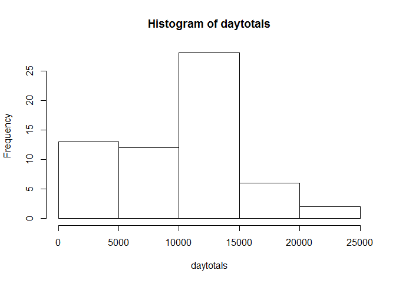
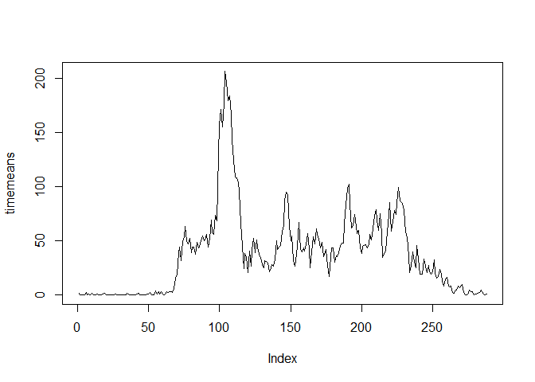
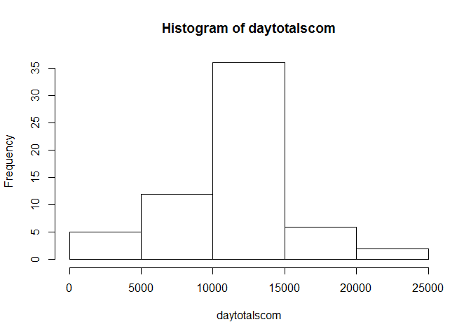
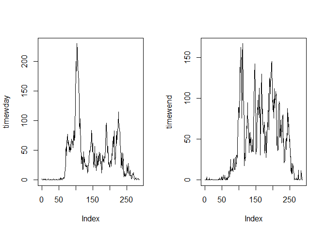

# Reproducible Research: Peer Assessment 1

```r
library(knitr)
opts_chunk$set(echo=TRUE)
```

## Loading and preprocessing the data

```r
unzip("activity.zip")
activitydata<-read.csv("activity.csv")
head(activitydata)
```

```
##   steps       date interval
## 1    NA 2012-10-01        0
## 2    NA 2012-10-01        5
## 3    NA 2012-10-01       10
## 4    NA 2012-10-01       15
## 5    NA 2012-10-01       20
## 6    NA 2012-10-01       25
```

## What is mean total number of steps taken per day?

```r
daytotals<-tapply(activitydata$steps,activitydata$date,sum,na.rm=TRUE)
hist(daytotals)
```

 


```r
mean(daytotals,na.rm=TRUE)
```

```
## [1] 9354
```

```r
median(daytotals,na.rm=TRUE)
```

```
## [1] 10395
```
## What is the average daily activity pattern?

```r
timemeans<-tapply(activitydata$steps,activitydata$interval,mean,na.rm=TRUE)
plot(timemeans,type="l")
```

 

```r
which.max(timemeans)
```

```
## 835 
## 104
```
## Imputing missing values

```r
sum(!complete.cases(activitydata))
```

```
## [1] 2304
```
NA values will be replaced by the average for the data period

```r
actmeans<-matrix(nrow=2,ncol=length(activitydata[,1]))
actmeans[1,]<-activitydata$interval
actmeans[2,]<-timemeans[]
activitydatacom<-activitydata
activitydatacom$steps[is.na(activitydatacom$steps)]<-actmeans[2,]
```

```
## Warning: number of items to replace is not a multiple of replacement
## length
```

```r
daytotalscom<-tapply(activitydatacom$steps,activitydatacom$date,sum,na.rm=TRUE)
hist(daytotalscom)
```

 

```r
mean(daytotalscom,na.rm=TRUE)
```

```
## [1] 10766
```

```r
median(daytotalscom,na.rm=TRUE)
```

```
## [1] 10766
```
## Are there differences in activity patterns between weekdays and weekends?

```r
activitydatacom$date<-as.Date(activitydatacom$date,"%Y-%m-%d")
activitydatacom$wday<-weekdays(activitydatacom$date)
activitydatacom$wday<-factor(activitydatacom$wday)
library(plyr)
activitydatacom$wday <- revalue(activitydatacom$wday, c("Monday" = "weekday", "Tuesday" = "weekday", "Wednesday" = "weekday", "Thursday" = "weekday", "Friday" = "weekday", "Saturday"="weekend", "Sunday"="weekend"))
adatawdays<-activitydatacom[activitydatacom$wday=="weekday",]
adatawends<-activitydatacom[activitydatacom$wday=="weekend",]
par(mfrow=c(1,2))
timewday<-tapply(adatawdays$steps,adatawdays$interval,mean,na.rm=TRUE)
plot(timewday,type="l")
timewend<-tapply(adatawends$steps,adatawends$interval,mean,na.rm=TRUE)
plot(timewend,type="l")
```

 
